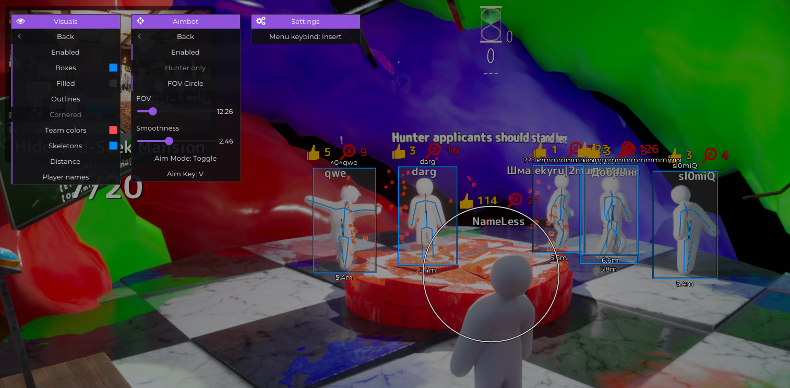

# Meccha-Trainer

Simple Meccha Chameleon aim trainer with visuals.
Dont pay for meccha chameleon cheats, the game currently has no anti cheat. Anything those cheats have will be right here soon!

*Star the repo and ill keep updating this with features :)*

# Overview
Simplistic internal tool for Meccha Chameleon for enhancing visuals and perfecting aim

## Features table

| Category | Feature | Options |
|----------|---------|---------|
| Aimbot | Aimbot | Keybind, Hold/Toggle, FOV, Smoothness |
| Aimbot | FOV Circle | Toggle |
| Aimbot | Hunter Only | Toggle |
| ESP | Box ESP | Toggle, Color |
| ESP | Corner Box | Toggle |
| ESP | Filled Box | Toggle, Color |
| ESP | Skeleton ESP | Toggle, Color |
| ESP | Name ESP | Toggle, Color |
| ESP | Distance ESP | Toggle |
| ESP | Team Colors | Toggle, Hunter Color |
| ESP | Outline | Toggle, Color |

## Problem table
| Problem | Solution | 
|----------|---------|
| Crash on Inject | SDK outdated, please notify me by creating an issue or waiting for me to update it (star repo for faster updates) |
| Player specific mods dont work | Host only (you need to be the host of the server) |
| Unlisted? | Open an issue on the repo and il look into it |

# How to use
Download latest Release and run MecchaLoader.exe when your game is open, or inject MecchaInternal.dll with any other native DLL injector.

If you crash on inject please check your game version when you launch in the top right it will show a version (eg 2.6.4) then check the release tag on this repo and see if the version in game matches. If not the SDK is outdated and il update it soon.

Thanks to Dumper-7 for UE SDK Generation
- https://github.com/Encryqed/Dumper-7

# Disclaimer
This project is for educational purposes. I am not responsible for any usage in online games, online bans or other consequences. Use at your own risk.
